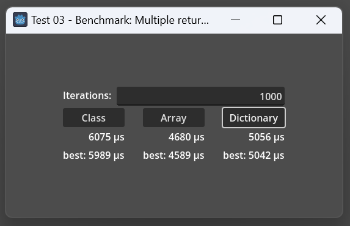

# Godot Benchmark: Returning multiple values from a function in GDScript

I recently wondered what the best way to return multiple values from a function would be. There are proposals but GDScript doesn't support this yet so we have to improvise and out of curiosity I wanted to know which would be the fastest.

I tried returning a class, an array and a dictionary. Sure, I could come with other atrocities but no sane person would actually use these.

So I made a small project and wrote a benchmark script that you can find below. For each benchmark we run a loop (by default 1000 times) and call a function that returns three values: An int, a Vector2 and a String. We measure how long this takes in microseconds.

For example:

```swift
func return_dictionary() -> Dictionary:
    return {"value": 42, "vector": Vector2(1.0, 2.0), "text": "some fancy text"}


func bench_dictionary(iterations: int):
    for i in iterations:
        var ret := return_dictionary()
        var s = "value: %d, vector: %s, text: \"%s\"" % [ret["value"], ret["vector"], ret["text"]]
        if len(s) != 50:
            print("string should be length %d but is %d instead" % [50, len(s)])
```

Note that we don't just measure how long it takes to create and return these values but we also *use* them because a) in a real world scenario you don't just want to return values and forget about them but instead you return them for a reason and using them afterwards is as important for the performance measurement as returning them and b) I make sure that GDScript now or in the future doesn't optimize the call away when the compiler realizes that we don't actually use the return values. Coming from C++ this is always an important part because C++ compilers are usually smarter than you and very happily remove code that actually has no effect.

Here are the results:



- Returning an array is fastest but the least readable.
- Returning a dictionary is 10% slower than returning an array.
- Returning a class is 30% slower than returning an array but the most readable.

This was from a debug version that I ran from the editor in Godot 4.1.2-rc2. I did export a non-debug Windows version but times didn't differ too much. IIRC returning an array and dictionary was 5% slower and returning a class was 15% slower in the debug version. So not too much of a difference.

Also note that I was comparing the best times but in reality these fluctuate a lot so in a proper benchmark you should take the median, which I am not doing here.

Main script: https://github.com/Toxe/godot-benchmark-multiple-return-values/blob/master/T03_BenchmarkMultipleReturnValues/main.gd

Also if you have the urge to click on something *right now:* I exported a web version that you can run here: https://toxe.itch.io/godot-benchmark-multiple-return-values

If you want to test it yourself you can also do this very fast and easy. Just copy the code below until the UI stuff into one of your scripts and run the benchmarks in for example a `_ready()` function:

```swift
func _ready():
    print(benchmark(bench_class, 1000))
    print(benchmark(bench_array, 1000))
    print(benchmark(bench_dictionary, 1000))
```

That's it.

Here is the complete code:

```python
extends Control


func benchmark(fn: Callable, iterations: int) -> int:
    var t0 = Time.get_ticks_usec()
    fn.call(iterations)
    var t1 = Time.get_ticks_usec()
    return t1 - t0


# ---- return class benchmark -----------------------------------------------
class Results:
    var value: int
    var vector: Vector2
    var text: String
    func _init(v1: int, v2: Vector2, v3: String):
        value = v1
        vector = v2
        text = v3


func return_class() -> Results:
    return Results.new(42, Vector2(1.0, 2.0), "some fancy text")


func bench_class(iterations: int):
    for i in iterations:
        var ret := return_class()
        var s = "value: %d, vector: %s, text: \"%s\"" % [ret.value, ret.vector, ret.text]
        if len(s) != 50:
            print("string should be length %d but is %d instead" % [50, len(s)])


# ---- return array benchmark -----------------------------------------------
func return_array() -> Array:
    return [42, Vector2(1.0, 2.0), "some fancy text"]


func bench_array(iterations: int):
    for i in iterations:
        var ret := return_array()
        var s = "value: %d, vector: %s, text: \"%s\"" % [ret[0], ret[1], ret[2]]
        if len(s) != 50:
            print("string should be length %d but is %d instead" % [50, len(s)])


# ---- return dictionary benchmark ------------------------------------------
func return_dictionary() -> Dictionary:
    return {"value": 42, "vector": Vector2(1.0, 2.0), "text": "some fancy text"}


func bench_dictionary(iterations: int):
    for i in iterations:
        var ret := return_dictionary()
        var s = "value: %d, vector: %s, text: \"%s\"" % [ret["value"], ret["vector"], ret["text"]]
        if len(s) != 50:
            print("string should be length %d but is %d instead" % [50, len(s)])


# ---- UI stuff -------------------------------------------------------------
var best_class_result := 9223372036854775807
var best_array_result := 9223372036854775807
var best_dictionary_result := 9223372036854775807


func run_benchmark_and_update_ui(benchmark_function: Callable, iterations: int, best_result: int, last_result_label: Label, best_result_label: Label) -> int:
    var t = benchmark(benchmark_function, iterations)
    last_result_label.text = "%d μs" % t
    if t < best_result:
        best_result_label.text = "best: %d μs" % t
        best_result = t
    return best_result


func _on_benchmark_class_button_pressed():
    best_class_result = run_benchmark_and_update_ui(bench_class, int(%IterationsLineEdit.text), best_class_result, %ResultsClassLabel, %BestResultClassLabel)


func _on_benchmark_array_button_pressed():
    best_array_result = run_benchmark_and_update_ui(bench_array, int(%IterationsLineEdit.text), best_array_result, %ResultsArrayLabel, %BestResultArrayLabel)


func _on_benchmark_dictionary_button_pressed():
    best_dictionary_result = run_benchmark_and_update_ui(bench_dictionary, int(%IterationsLineEdit.text), best_dictionary_result, %ResultsDictionaryLabel, %BestResultDictionaryLabel)


func _on_iterations_line_edit_text_changed(_new_text):
    best_class_result = 9223372036854775807
    best_array_result = 9223372036854775807
    best_dictionary_result = 9223372036854775807
    %BestResultClassLabel.text = ""
    %BestResultArrayLabel.text = ""
    %BestResultDictionaryLabel.text = ""
```
